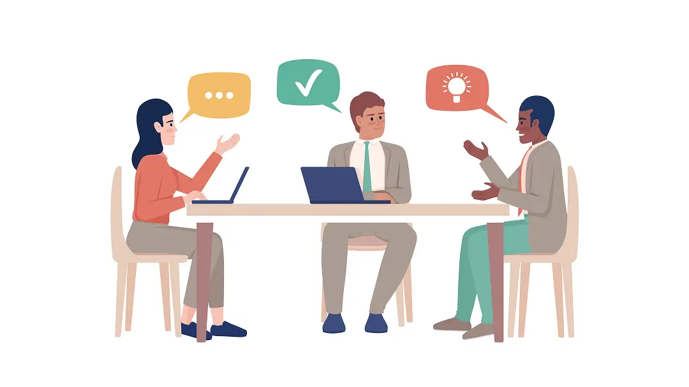
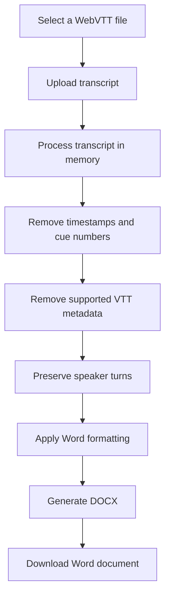

# VTT to DOCX Transcript Converter


<p align="center">
  <strong>Convert WebVTT transcripts into clean, research-ready Microsoft Word documents.</strong>
</p>

<p align="center">
  A lightweight, privacy-conscious Streamlit application for researchers, students, academics, UX/HCD practitioners, and anyone working with interview or meeting transcripts.
</p>

<p align="center">
  <a href="https://vtt-to-word.streamlit.app/"><strong>Launch the application</strong></a>
  ·
  <a href="#privacy-and-data-handling">Privacy</a>
  ·
  <a href="#contributing">Contribute</a>
</p>

<p align="center">
  
  
  
  
  
</p>

---

## Overview

**VTT to DOCX Transcript Converter** transforms WebVTT (`.vtt`) transcript files into readable Microsoft Word (`.docx`) documents. It removes VTT-specific timing and cue information while preserving the original conversational sequence and formatting speaker names for easier review and qualitative analysis.

### Why use it?

- Produce a clean Word transcript without manually removing VTT timestamps
- Preserve interviewer questions, participant responses, and speaker order
- Add an optional project-specific header to every page
- Generate page numbering in the format **Page X of Y**
- Use the hosted application without installing software or creating an account

> [!IMPORTANT]
> This converter formats existing transcript text. It does not perform speech-to-text transcription, correct transcript errors, summarise interviews, interpret responses, or perform thematic analysis.

---

## Features

### Transcript processing

- Upload `.vtt` transcript files through a browser
- Remove `WEBVTT` headers, timestamps, cue numbers, and supported metadata
- Preserve the original order of speaker turns
- Preserve interviewer prompts and participant responses
- Identify and format speaker labels

### Word document output

- Generate Microsoft Word `.docx` files
- Format speaker names in **bold**
- Format transcript text in **Calibri, 12 pt**
- Add an optional document header of up to **four lines**
- Repeat the document header on every page
- Add page numbering in the format **Page X of Y**

### Application design

- Run as a lightweight Streamlit application
- Operate without a transcript database
- Process transcript content for the requested conversion
- Provide the generated document directly for download

---

## Live Application

The application is deployed on Streamlit Community Cloud.

<p align="center">
  <a href="https://vtt-to-word.streamlit.app/">
    
  </a>
</p>

No installation or account is required to use the hosted application.

---

## How It Works



The converter focuses on document transformation rather than transcript interpretation. The wording and sequence of the supplied transcript are retained as closely as possible while VTT-specific structural content is removed.

---

## Usage

### 1. Add an optional document header

Enter up to four lines of information to be displayed in the header of every page.

```text
Researcher: Jane Smith
Project: Human-Centred Design Study
Participant: Participant A
Session: Follow-up Interview
```

The field is flexible, allowing you to use headings that suit your project or research requirements.

### 2. Upload a WebVTT transcript

Select a file with the `.vtt` extension. A typical input file looks like this:

```vtt
WEBVTT

1
00:00:02.020 --> 00:00:04.729
Interviewer: Thank you for joining the interview.

2
00:00:05.030 --> 00:00:07.009
Participant: Thank you. Happy to participate.
```

### 3. Convert the transcript

The application removes:

- The `WEBVTT` header
- Cue numbers
- Timestamps
- Supported VTT formatting tags and metadata

The original conversational sequence is preserved.

### 4. Download the Word document

Select **Download DOCX** after processing is complete. The generated document will contain formatted dialogue similar to:

> **Interviewer:** Thank you for joining the interview.
>
> **Participant:** Thank you. Happy to participate.

---

## Document Formatting

| Element | Output format |
|---|---|
| File type | Microsoft Word `.docx` |
| Body font | Calibri |
| Font size | 12 pt |
| Speaker names | Bold |
| Dialogue | Normal text |
| Speaker sequence | Preserved |
| Document header | Optional, maximum four lines |
| Header placement | Repeated on every page |
| Footer | Page numbering on every page |
| Page-number format | Page X of Y |

This formatting is intended to produce a clean, readable transcript suitable for research documentation and qualitative analysis.

---

## Preserving Interview Context

The converter preserves individual speaker turns rather than combining consecutive statements attributed to the same person.

This is important in research interviews because follow-up prompts, clarification questions, and participant responses provide context that may be lost if dialogue is merged.

### Example

> **Participant:** I found the interface easy to use.
>
> **Interviewer:** What specifically made it easy to use?
>
> **Participant:** The navigation was simple and I could quickly find what I needed.

This structure is useful for:

- Qualitative research
- Contextual Inquiry
- Human-Centred Design research
- User interviews
- Usability studies
- Thematic analysis
- Research coding
- Academic quotation and referencing

---

## Privacy and Data Handling

> [!NOTE]
> **The application is designed not to store or retain voice recordings, transcript content, or generated Word documents after conversion.** Uploaded content is processed for the purpose of generating the requested document, and the application does not require a transcript database.

No transcript content should be deliberately written to application logs or persistent storage. This statement must remain aligned with the deployed source code, application logging configuration, Streamlit hosting configuration, and any third-party services introduced in the future.

Users remain responsible for complying with applicable:

- Research ethics approvals
- Participant consent arrangements
- Institutional data-management policies
- Privacy and confidentiality requirements
- Data-retention obligations

Where required, anonymise or de-identify transcript data before processing or sharing it.

## Project Structure

```text
vtt-to-docx-streamlit/
├── app.py
├── requirements.txt
├── README.md
└── .gitignore
```

| File | Purpose |
|---|---|
| `app.py` | Streamlit interface, VTT processing, DOCX generation, headers, page numbering, and downloads |
| `requirements.txt` | Python package dependencies |
| `README.md` | Project documentation |
| `.gitignore` | Excludes local environments, cache files, and unnecessary generated files |

---

## Technology Stack

- **Python**
- **Streamlit**
- **python-docx**
- **Microsoft Word Open XML**
- **GitHub**
- **Streamlit Community Cloud**

---

## Intended Use

The converter may be useful for transcripts produced from:

- Research interviews
- Contextual Inquiry sessions
- Human-Centred Design studies
- UX research
- Usability testing
- Academic interviews
- Focus groups
- User-research sessions
- Meeting recordings
- Online interview platforms
- Video-conferencing transcription tools

Input must be supplied in WebVTT (`.vtt`) format.

---

### Word page fields

Page numbering uses the Microsoft Word `PAGE` and `NUMPAGES` fields and is displayed in the following format:

```text
Page 1 of 10
```

Microsoft Word normally calculates these fields when the document is opened. Some alternative DOCX viewers may not immediately refresh them.

---

## Contributing

Contributions, suggestions, and bug reports are welcome.

1. Fork the repository.
2. Create a feature branch.
3. Make and test your changes.
4. Submit a pull request with a clear description.

You can also open a GitHub Issue to report a problem or propose an improvement.

---


## Acknowledgements

Built with Python, Streamlit, and python-docx.

<p align="center">
  <a href="https://vtt-to-word.streamlit.app/"><strong>Open VTT to DOCX Transcript Converter</strong></a>
</p>
